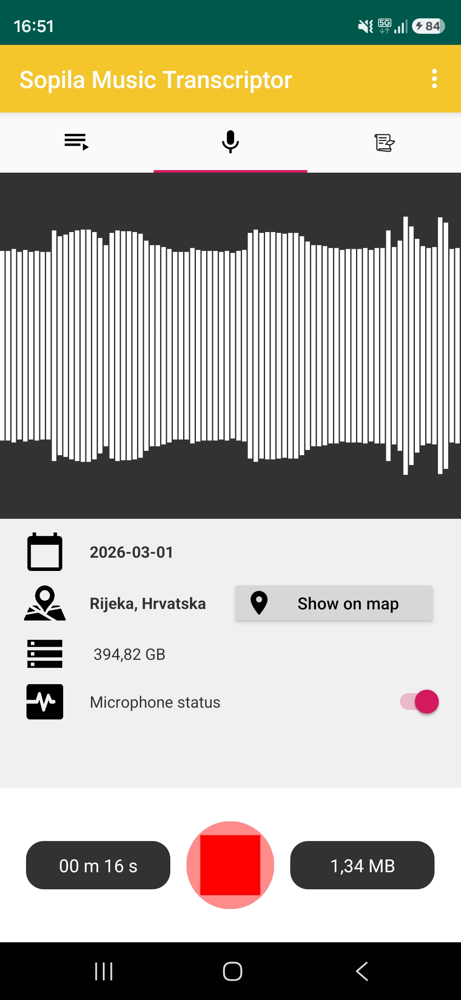
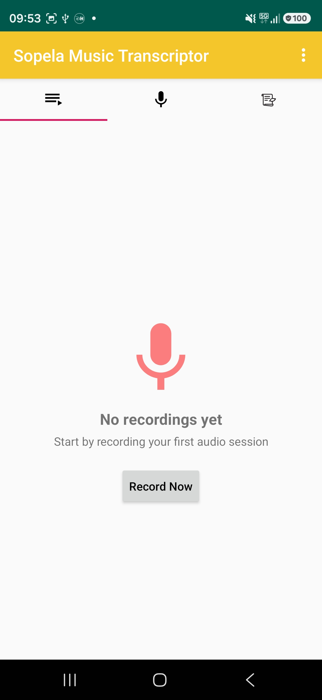
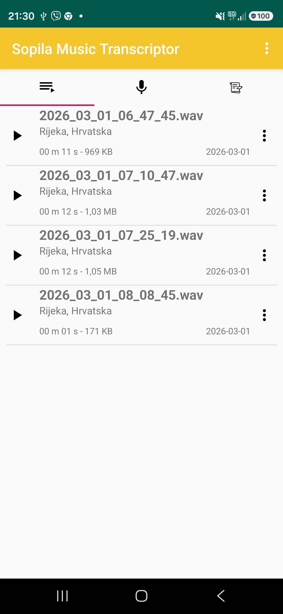
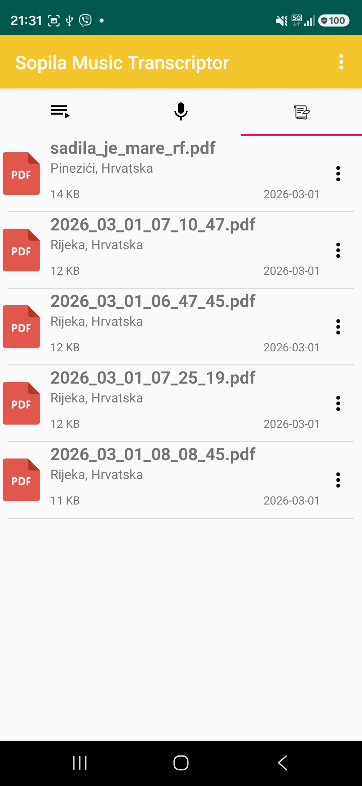
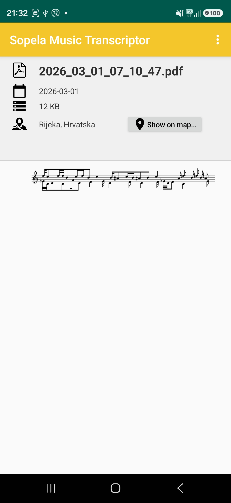
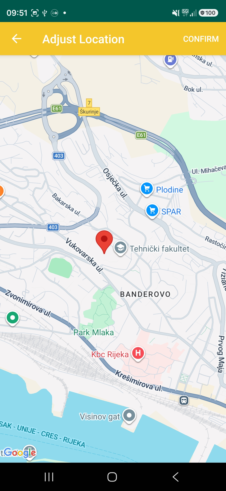
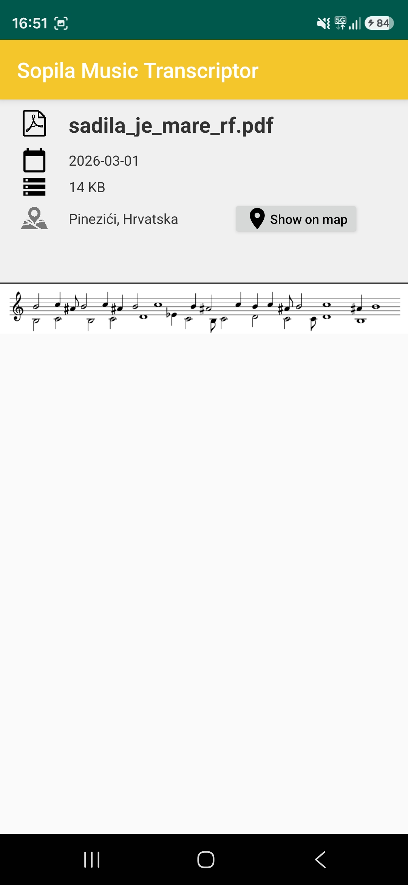

# Sopila Transcriptor

An Android application designed to record, manage, and transcribe music recordings with integrated location tracking and sheet music visualization.

## 📱 User Guide

Welcome to the **Sopila Transcriptor** app! This guide helps you understand how to use the different features to record and manage your music.

---

### 1. Main Dashboard
The main screen is divided into three sections (tabs) that you can switch between by swiping left or right or tapping the icons at the top.

#### **🎙️ Recording Tab (Middle Icon - Microphone)**
This is where you capture new audio.
*   **Record Button:** Tap the large circular button in the center to start recording, and it will transform into a square.
*   **Recording Name:** Tap the recording button again to stop and save the file using a chosen name (defaults to time and date) or cancel.
*   **Microphone Status:** The microphone status toggle button will automatically switch after you press the record button.
*   **Sound Visualizer:** While recording, you will see waves moving and a pulsing animation, showing that the app is picking up sound.
*   **Time and Size:** Real-time display of how long you've been recording (minutes and seconds) and the file size.
*   **Storage Info:** Monitors available internal memory to ensure you have enough space.
*   **Location Permissions:** The app automatically finds your location.
*   **Location Icon:** Tap the location icon to let the app retry and automatically find your location.
*   **Location Text:** Tap the location text to manually adjust it on a map if needed.
*   **View Location:** The location is viewed using the "Show on map" button.
*   **Adjust Location:** The location is adjusted by dragging the red marker.
*   **Confirm Location:** You must click Confirm to save the changes.



#### **📂 Recordings List (Left Icon - List)**
Browse through your collection of recorded audio files.
*   **View Recordings:** Lists all recordings with their names and dates.
*   **Delete Recordings:** In the context menu on the right, you can delete the recordings.
*   **Rename Recordings:** In the context menu on the right, you can rename the recordings, with cancel and save options.
*   **Export as PDF:** In the context menu on the right, you can upload the `.wav` recordings to the Django backend server.
*   **FFmpeg and LilyPond:** `FFmpeg` processes the audio files, and `LilyPond` renders the sheet music in PDF format to download.
*   **Machine Learning:** The transcription is done using the Random Forest (RF) model and the Discrete Fourier Transform (DFT).
*   **Model Parameters:** The model uses `scikit-learn` and default parameters, unless stated otherwise.
    *   **n_estimators:** 900
    *   **criterion:** Gini
    *   **min_samples_split:** 2
    *   **max_samples_leaf:** 1
    *   **max_features:** auto**
    *   **max_depth:** 80
    *   **bootstrap:** false
*   **Show on Map:** In the context menu on the right, you can view the location where the recording was made.
*   **Location Saving:** The app automatically saves the location where the recording was made.
*   **Default Location:** Your current location is used if location information for the recording is unavailable.
*   **View Location:** The location is viewed using the "Show on map" option in the context menu.
*   **Fetch Location:** The app automatically finds your location using the "Fetch location" option in the context menu.
*   **Adjust Location:** The location is adjusted using the "Adjust location" option in the context menu.
*   **Confirm Location:** You must click Confirm to save the changes after dragging the red marker.
*   **Record Now:** If no recordings exist, this button guides you to the recording screen.




#### **🎼 Sheet Music List (Right Icon - Music Note)**
Access your transcribed music and Portable Document Format (PDF) documents.
*   **View Sheets:** Tap any item in the list to open the detailed viewer.
*   **Delete Sheets:** In the context menu on the right, you can delete the sheets.
*   **Rename Sheets:** In the context menu on the right, you can rename the sheets, with cancel and save options.
*   **Show on Map:** In the context menu on the right, you can view the location where the sheet was made.
*   **Location Saving:** The app automatically saves the location where the sheet was made.
*   **Default Location:** Your current location is used if location information for the sheets is unavailable.
*   **View Location:** The location is viewed using the "Show on map" option in the context menu.
*   **Fetch Location:** The app automatically finds your location using the "Fetch location" option in the context menu.
*   **Adjust Location:** The location is adjusted using the "Adjust location" option in the context menu.
*   **Confirm Location:** You must click Confirm to save the changes after dragging the red marker.
*   **Sample File:** If no sheets exist, the file `sadila_je_mare_rf.pdf` provides an example without location editing options (defaults to Pinezići, Hrvatska).



---

### 2. Sheet Music and PDF Viewer
Open a music sheet to see detailed information and the notation itself.
*   **Document Viewer:** Displays a preview of the music notation.
*   **File Details:** Shows the filename, file size, and the creation date (YYYY-mm-dd).
*   **Geographic Context:**
    *   **Location Icon:** Tap the location icon to let the app retry and automatically find your location.
    *   **Show on Map:** Tap the map icon or button to see the exact spot where the music was recorded.
    *   **Change Location:** Tap the address text to move the pin on a map to refine the location.
*   **Manage File:** Use the menu (three dots) in the top right corner to **Rename** the file, with cancel and save options, or **Delete** it.



---

### 3. Interactive Map
Used for both displaying and refining location data.
*   **Viewing:** Shows a red pin at the recording location.
*   **Adjusting:** In "Adjust" mode, tap anywhere on the map to move the pin.
*   **Confirming:** Tap **Confirm** at the top to save.


---

### 4. Settings and Permissions
*   **Server Settings:** Found in the top menu of the main screen, "Edit server IP address" is used to set up the connection for transcribing music.
*   **Test PDF:** Found in the top menu of the main screen, "Test PDF" is used to view the test file `sadila_je_mare_rf.pdf`.
*   **Permissions:** The app requires **Microphone**, **Location**, and **Storage** access to function correctly.



---

## 📥 Installation Guide for the Android Package Kit (APK)

Installing an application manually from an APK file differs slightly from installing it via the Google Play Store. Since this is a "debug" version, your phone's security settings will likely block it initially to protect you.

Android includes security mechanisms to protect users from installing applications from untrusted sources. When you try to install an app from an unknown source, such as an APK file from Google Drive or transferred via Universal Serial Bus (USB), Android will block the process by default.

### Step-by-Step Installation

#### Locate the File
Open your phone's **File Manager** or **Files** app. Go to your **Downloads** folder. You should see the `.apk` file there.

#### Enable "Install Unknown Apps"
When you tap the file, a security warning will appear.
*   Click **Settings** on that pop-up.
*   Toggle the switch for **"Allow from this source"**.
*   Go back to the file.

#### Complete the Installation
*   Tap the `.apk` file again.
*   Tap **Install** when prompted.
*   Once finished, tap **Open**.

#### Critical Step: The "Play Protect" Warning
Because this is a "debug" file, Google Play Protect will likely show a full-screen warning labeled **"Blocked by Play Protect"**.
1. **Do NOT** click "Got it" or "OK" (this cancels the installation).
2. Tap the small dropdown arrow or **"More details"** link.
3. Click **"Install anyway"**.

---

### Troubleshooting Tips
*   **Storage Space:** Ensure you have enough free storage.
*   **Previous Versions:** If you have an older version, uninstall it first before installing the new one.
*   **App not installed:** Ensure the APK is compatible with your Android version.

---

### Device-Specific Instructions (Android 10+)

#### **Samsung (One UI)**
*   Go to **Settings** > **Security and Privacy** > **Install unknown apps**.
*   Toggle **"My Files"** to **On**.
*   *Note:* If installation fails, disable **Auto Blocker** in Security settings.

#### **Google Pixel / Motorola (Stock Android)**
*   Go to **Settings** > **Apps** > **Special app access** > **Install unknown apps**.
*   Select **Chrome** or **Files by Google** and toggle **Allow from this source**.

#### **Xiaomi / Redmi / POCO**
*   Go to **Settings** > **Protection & Privacy** > **Special permissions** > **Install unknown apps**.
*   Select **File Manager**. Accept the warning and wait for the **10-second timer** before hitting **OK**.

#### **OPPO / Vivo / Realme**
*   Go to **Settings** > **Security** > **Installation sources**.
*   Find **File Manager** and set it to **Allowed**.

---

## 🛠️ Technical Details for Developers

### Clone the Repository

Open your terminal and run the following commands to clone the GitHub repository:
```sh
git clone https://github.com/LucijaZuzic/SopilaTranscriptor.git
cd SopilaTranscriptor
```

### Project Environment
To build the project correctly, ensure your environment matches these specifications:
*   **Android Studio:** Latest stable version recommended (Panda 1, Patch 1 at the time of writing)
*   **Java Development Kit (JDK) Version:** 11 or higher (go to **File** > **Settings** > **Build, Execution, Deployment** > **Build Tools** > **Gradle** > **Gradle JDK**)
*   **Gradle Version:** 7.2 (configured via Gradle Wrapper).
*   **AGP (Android Gradle Plugin):** 7.1.3.
*   **Compile Software Development Kit (SDK):** 33 (configured in **File** > **Project Structure** > **SDK Location**)
*   **Target SDK:** 33
*   **Minimum SDK:** 21 (Android 5.0 Lollipop)

### How to Generate the APK in Android Studio
To get the latest version of the app as an APK file for testing:
1. Open the project in **Android Studio**.
2. Go to the **Build** menu at the top.
3. Select **Build Bundle(s) / APK(s)** > **Build APK(s)**.
4. Wait for the build process to finish. A notification will appear in the bottom-right corner.
5. Click **Locate** in the notification to open the folder containing `app-debug.apk`.
    * *Manual Path:* `app/build/intermediates/apk/debug/app-debug.apk`

> **Note on APK Location:**
> In modern Android Studio builds, clicking the "Run" button (Green Play Icon) often performs an incremental build to deploy directly to a device. This process generates the APK within the `intermediates/` directory, which holds transient build artifacts.
> The `outputs/apk/` directory is the standard distribution folder and is typically only populated when you explicitly execute a full **Assemble** or **Build APK** task. By referencing the `intermediates` path, you ensure access to the most recent binary regardless of the specific build trigger used.

### Core Features and Libraries
- **Audio Recording:** Uses `om-recorder` for WAV (Waveform Audio File Format) capture (44.1kHz, 16-bit Mono).
- **PDF Rendering:** Built-in `PdfRenderer` for displaying sheet music.
- **Location Services:** Uses Google Play Services (Fused Location Provider).
- **Network:** Retrofit 2.5.0 for backend communication.
- **Persistence:** Metadata and server configurations are stored using `SharedPreferences`.

### Getting Started
1. **Build:** Standard Gradle build.
2. **Server IP:** Set the backend server address in the settings menu.


# Appendix

This repository is part of a larger project for the automatic transcription of sopila (a traditional Croatian instrument) music.

## Scientific Papers

*   The scientific papers describe the:
    *   ***Sopele*** **music dataset:** [https://doi.org/10.1016/j.dib.2019.104840](https://doi.org/10.1016/j.dib.2019.104840)
    *   **Automatic music transcription for traditional woodwind instruments sopele:** [https://doi.org/10.1016/j.patrec.2019.09.024](https://doi.org/10.1016/j.patrec.2019.09.024)

## Repository Index

*   The repositories include the:
    *   **Web Interface Code:** [https://github.com/LucijaZuzic/sopila_transcriptor_web](https://github.com/LucijaZuzic/sopila_transcriptor_web)
    *   **Android Application:** [https://github.com/LucijaZuzic/SopilaTranscriptor](https://github.com/LucijaZuzic/SopilaTranscriptor)
        *   **Forked from:** [https://github.com/askoki/SopilaTranscriptor](https://github.com/askoki/SopilaTranscriptor)
    *   **Django Backend Server:** [https://github.com/LucijaZuzic/django-sopila](https://github.com/LucijaZuzic/django-sopila)
        *   **Forked from:** [https://github.com/askoki/django-sopila](https://github.com/askoki/django-sopila)
    *   **Machine Learning Model Training:** [https://github.com/LucijaZuzic/sopila-transcriptor](https://github.com/LucijaZuzic/sopila-transcriptor)
        *   **Forked from:** [https://github.com/askoki/sopila-transcriptor](https://github.com/askoki/sopila-transcriptor)

## Machine Learning

The models use `scikit-learn` and default parameters, unless stated otherwise.

*   The transcription is done with the following possible setups:
    *   **Music Type:**
        *   **Polyphonic (Poly):** two instruments (both small and great sopila) - **used in deployment**
        *   **Monophonic (Mono):** a single instrument (small or great sopila)
    *   **Architecture:**
        *   the Random Forest (RF) model - **used in deployment**
        *   a Convolutional Neural Network (CNN)
    *   **Discrete Fourier Transform (DFT):**
        *   with the DFT - **used in deployment**
        *   without the DFT

*   The model parameters were obtained in hyperparameter tuning:
    *   **Poly RF DFT (used in deployment):**
        *   **n_estimators:** 900
        *   **criterion:** Gini
        *   **min_samples_split:** 2
        *   **max_samples_leaf:** 1
        *   **max_features:** auto**
        *   **max_depth:** 80
        *   **bootstrap:** false
    *   **Poly RF:**
        *   **n_estimators:** 1000
        *   **criterion:** Gini
        *   **min_samples_split:** 6
        *   **max_samples_leaf:** 1
        *   **max_features:** auto**
        *   **max_depth:** 60
        *   **bootstrap:** false
    *   **Mono RF DFT:**
        *   **n_estimators:** 1000
        *   **criterion:** entropy
        *   **min_samples_split:** 2
        *   **max_samples_leaf:** 1
        *   **max_features:** auto**
        *   **max_depth:** 60
        *   **bootstrap:** false
    *   **Mono RF:**
        *   **n_estimators:** 900
        *   **criterion:** Gini
        *   **min_samples_split:** 2
        *   **max_samples_leaf:** 1
        *   **max_features:** auto**
        *   **max_depth:** 80
        *   **bootstrap:** false

# Supplementary Links

*   The supplementary links define the:
    *   **Web Interface Access:**
        *   [https://sopilatranscriptorweb.firebaseapp.com/](https://sopilatranscriptorweb.firebaseapp.com/)
    *   **Application Installation Android Package Kit (APK):**
        *   [https://drive.google.com/file/d/1pdoee_afd3XuugroIi6P6vlkh9txp2-h/view?usp=drive_link](https://drive.google.com/file/d/1pdoee_afd3XuugroIi6P6vlkh9txp2-h/view?usp=drive_link)
    *   **Trained Machine Learning Models:**
        *   **Poly RF DFT (used in deployment):** [https://drive.google.com/file/d/1HIAFEaunJomerYyrKrfPycj9OpVPSkuP/view?usp=drive_link](https://drive.google.com/file/d/1HIAFEaunJomerYyrKrfPycj9OpVPSkuP/view?usp=drive_link)
        *   **Poly RF:** [https://drive.google.com/file/d/11_mbaqlTAu3-1QkXD8GqYuaBDI1J5DEP/view?usp=drive_link](https://drive.google.com/file/d/11_mbaqlTAu3-1QkXD8GqYuaBDI1J5DEP/view?usp=drive_link)
        *   **Mono RF DFT:** [https://drive.google.com/file/d/1_fHYT2Ykz4xWumwj4j0yT-wxdwABUEQ9/view?usp=drive_link](https://drive.google.com/file/d/1_fHYT2Ykz4xWumwj4j0yT-wxdwABUEQ9/view?usp=drive_link)
        *   **Mono RF:** [https://drive.google.com/file/d/1UhBfw_QOduRCRDoJjlifEHBBNoOirqUL/view?usp=drive_link](https://drive.google.com/file/d/1UhBfw_QOduRCRDoJjlifEHBBNoOirqUL/view?usp=drive_link)
